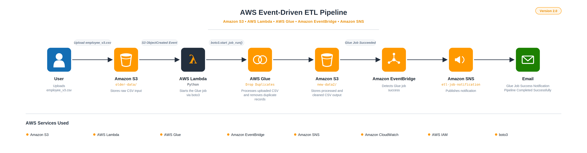
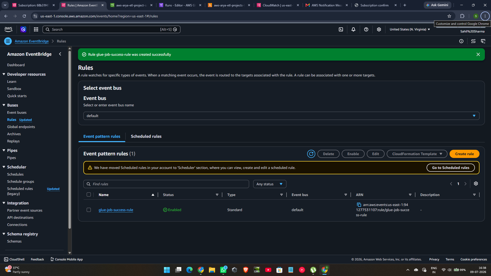
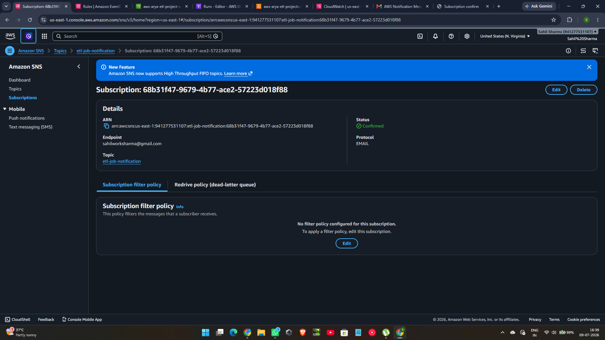
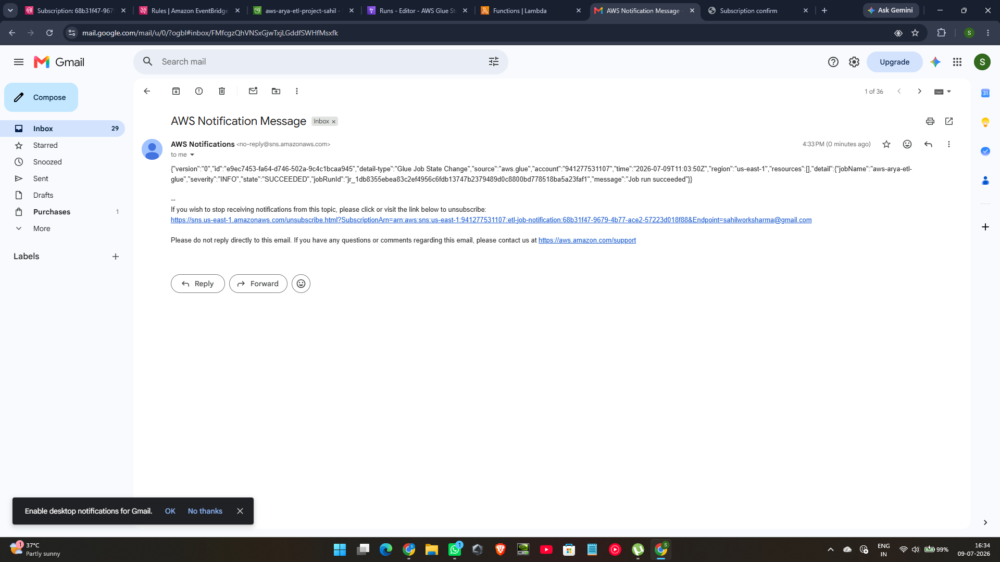

# 🚀 AWS Event-Driven ETL Pipeline (Version 2.0)

An end-to-end **serverless Event-Driven ETL Pipeline** built using AWS services.

The pipeline automatically processes CSV files uploaded to Amazon S3, triggers an AWS Lambda function, executes an AWS Glue ETL job to remove duplicate records, stores the cleaned data in Amazon S3, and finally sends an email notification using Amazon EventBridge and Amazon SNS when the ETL job completes successfully.

This project demonstrates how multiple AWS services can work together to build a scalable, automated, event-driven data engineering workflow.

---

# 📌 Project Overview

The pipeline performs the following tasks automatically:

- Upload a CSV file into Amazon S3.
- Amazon S3 triggers AWS Lambda.
- Lambda starts an AWS Glue ETL Job using boto3.
- AWS Glue removes duplicate records.
- Cleaned data is stored in another S3 folder.
- Amazon EventBridge detects successful Glue Job completion.
- Amazon SNS publishes a notification.
- An email is automatically delivered to the subscribed user.

No manual intervention is required after uploading the dataset.

---

# 🏗️ Architecture

<p align="center">

</p>

---

# ⚙️ AWS Services Used

| AWS Service | Purpose |
|-------------|---------|
| Amazon S3 | Stores raw and processed CSV files |
| AWS Lambda | Automatically starts the Glue ETL job |
| AWS Glue Studio | Performs ETL and removes duplicate records |
| Amazon EventBridge | Detects successful Glue Job completion |
| Amazon SNS | Sends email notifications |
| Amazon CloudWatch | Stores Lambda execution logs |
| AWS IAM | Manages permissions |
| boto3 | Starts Glue Job programmatically |

---

# 📂 Project Structure

```text
ETL/
│
├── lambda/
│   └── trigger_glue_job.py
│
├── sample-data/
│   ├── employee_v3.csv
│   └── cleaned_output.csv
│
├── screenshots/
│   ├── 01-s3-input-folder.png
│   ├── 02-lambda-function-code.png
│   ├── 03-lambda-trigger-configuration.png
│   ├── 04-cloudwatch-lambda-logs.png
│   ├── 05-glue-visual-etl-workflow.png
│   ├── 06-glue-job-run-success.png
│   ├── 07-s3-output-folder.png
│   ├── 08-cleaned-output-csv.png
│   ├── 09-architecture.png
│   ├── 10-eventbridge-rule.png
│   ├── 11-sns-topic.png
│   └── 12-sns-email-notification.png
│
├── architecture.png
├── README.md
└── .gitignore
```

---

# 🔄 Workflow

1. Upload **employee_v3.csv** into **older-data/** in Amazon S3.
2. Amazon S3 generates an **ObjectCreated** event.
3. AWS Lambda is triggered automatically.
4. Lambda starts the AWS Glue Job using **boto3.start_job_run()**.
5. AWS Glue removes duplicate records.
6. Processed CSV is stored inside **new-data2/**.
7. Amazon EventBridge detects **Glue Job Succeeded**.
8. EventBridge forwards the event to Amazon SNS.
9. Amazon SNS sends an email notification to the subscribed user.

---

# 📊 Dataset Used

### Input

Employee CSV dataset containing duplicate records.

### Transformation

- Read CSV
- Remove duplicate records using AWS Glue Visual ETL

### Output

Clean CSV containing only unique employee records.

---

# ✨ Key Features

- Event-Driven Architecture
- Fully Serverless Workflow
- Automatic ETL Execution
- Duplicate Record Removal
- AWS Glue Visual ETL
- EventBridge Integration
- Amazon SNS Email Notifications
- CloudWatch Logging
- Automatic Pipeline Monitoring
- No Manual Intervention

---

# 📸 Project Screenshots

## 1. Amazon S3 Input Folder


---

## 2. Lambda Function Code


---

## 3. Lambda Trigger Configuration


---

## 4. CloudWatch Logs


---

## 5. AWS Glue Visual ETL Workflow


---

## 6. Successful Glue Job Run


---

## 7. Amazon S3 Output Folder


---

## 8. Cleaned CSV Output


---

## 9. Project Architecture



---

## 10. Amazon EventBridge Rule



---

## 11. Amazon SNS Topic & Subscription



---

## 12. Email Notification



---

# 💻 Technologies Used

- Python
- boto3

### AWS Services

- Amazon S3
- AWS Lambda
- AWS Glue Studio
- Amazon EventBridge
- Amazon SNS
- Amazon CloudWatch
- AWS IAM

---

# 🚀 Future Enhancements (Version 3.0)

The next version of this project will include:

- Interactive Web Dashboard
- Live Pipeline Monitoring
- Upload CSV directly from Dashboard
- Download Processed CSV
- Processing Statistics
- Amazon DynamoDB Integration
- AWS API Gateway
- Job History Tracking
- Real-time Dashboard Updates

---

# 👨‍💻 Author

**Sahil Sharma**

B.Tech Computer Science Engineering

Interested in

- Cloud Computing
- Machine Learning
- Data Engineering
- AWS
- MLOps

---

# 📚 Learning Outcomes

Through this project I learned:

- Building serverless ETL pipelines
- Configuring Amazon S3 Event Notifications
- Invoking AWS Glue from AWS Lambda using boto3
- Working with AWS Glue Visual ETL
- Managing IAM Roles and Permissions
- Monitoring Lambda using CloudWatch
- Building Event-Driven Architectures
- Configuring Amazon EventBridge Rules
- Integrating Amazon SNS for Email Notifications
- Designing scalable AWS workflows

---

# ⭐ Support

If you found this project useful, please consider giving it a ⭐ on GitHub.

It helps others discover the project and motivates further improvements.

---

## Version History

### ✅ Version 1.0

- S3 → Lambda → Glue ETL
- Duplicate Removal
- Processed CSV Output

### ✅ Version 2.0

- Amazon EventBridge Integration
- Amazon SNS Integration
- Automatic Email Notifications
- Improved Architecture
- Enhanced Documentation

### 🚧 Version 3.0 (Coming Soon)

- Interactive Dashboard
- Real-time Monitoring
- Pipeline Analytics
- Job History
- API Integration

---