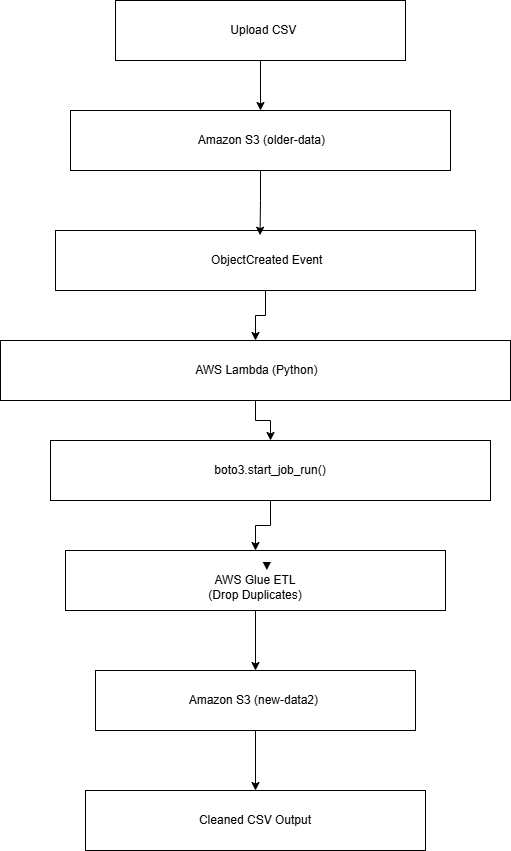
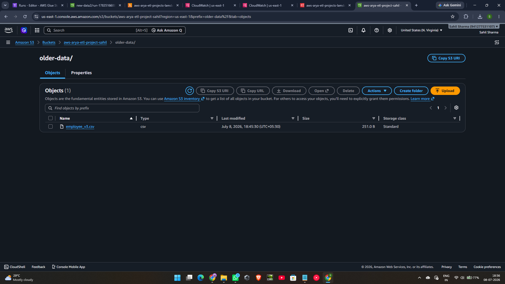
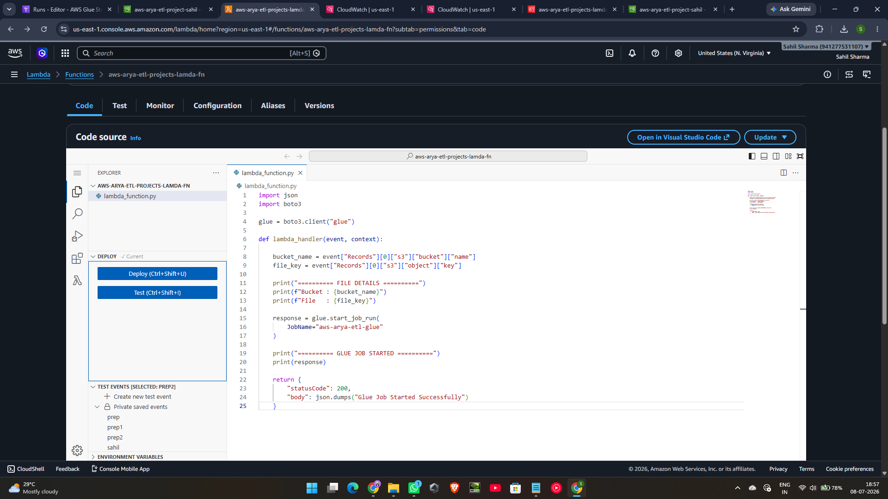
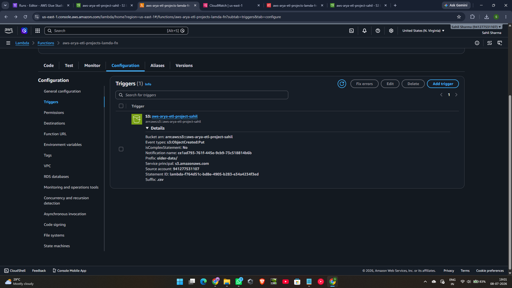
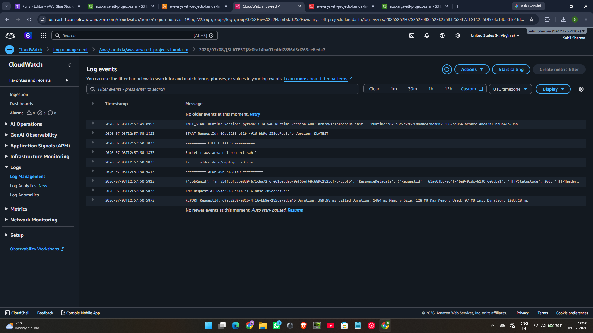
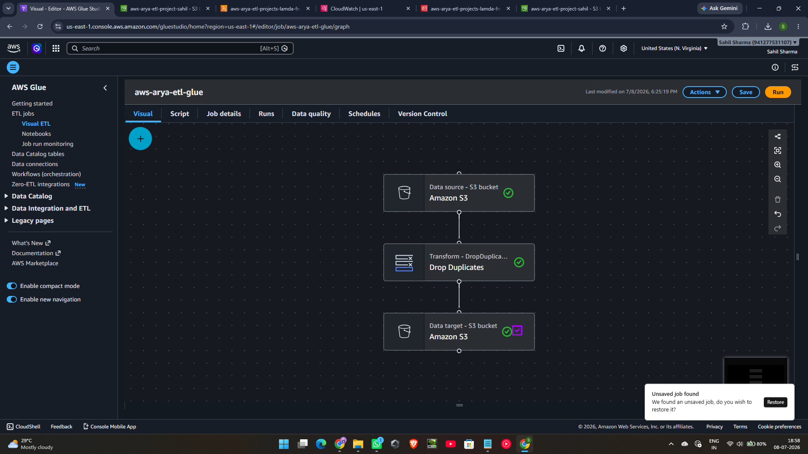
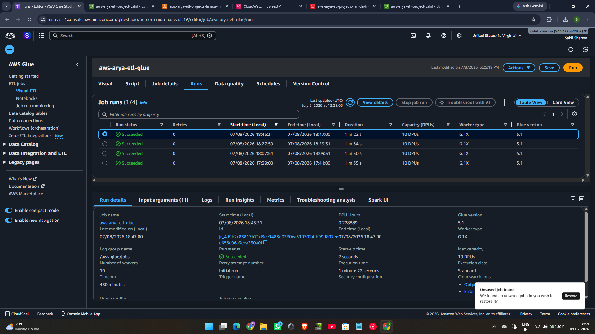
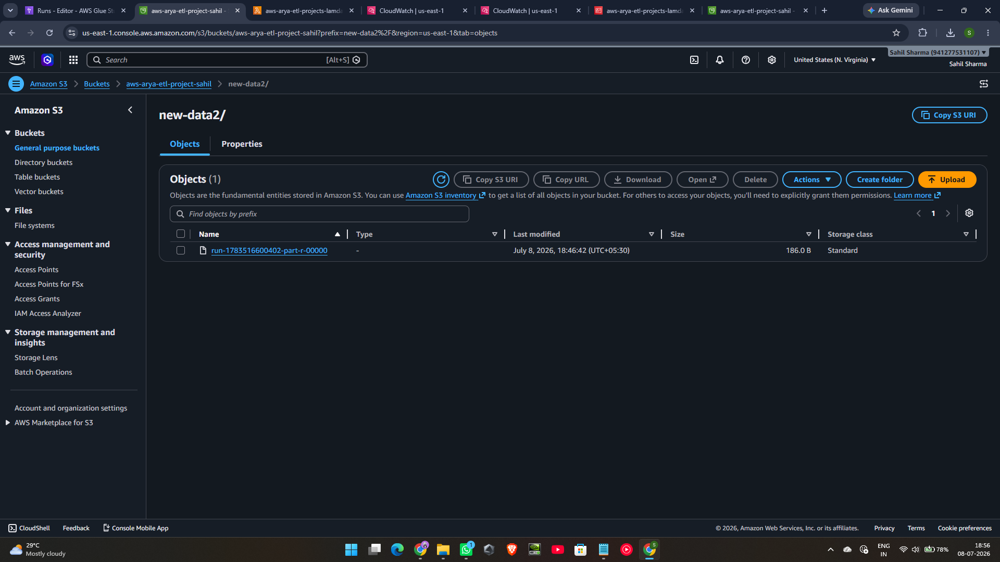
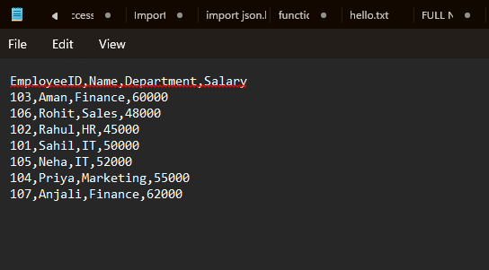

# 🚀 AWS Event-Driven ETL Pipeline | Amazon S3 • AWS Lambda • AWS Glue • Python

<p align="center">


</p>

---

## 📌 Overview

This project demonstrates a **fully automated event-driven ETL (Extract, Transform, Load) pipeline** built using core AWS services.

Whenever a CSV file is uploaded to an **Amazon S3 bucket**, an **AWS Lambda** function is automatically triggered. The Lambda function starts an **AWS Glue ETL job** using **boto3**, which removes duplicate records from the dataset and stores the cleaned CSV file back into Amazon S3.

The entire workflow is **serverless**, automated, and requires **zero manual intervention** after uploading the file.

This project was built to gain practical experience with AWS event-driven architectures, ETL workflows, IAM permissions, and cloud automation.

---

# ✨ Project Highlights

- ✅ Event-Driven Architecture
- ✅ Fully Serverless Workflow
- ✅ Automatic ETL Processing
- ✅ AWS Glue Visual ETL
- ✅ Duplicate Record Removal
- ✅ CloudWatch Monitoring
- ✅ IAM Role Configuration
- ✅ Python Automation using boto3
- ✅ Real AWS Services (No Simulation)

---

# 🎯 Problem Statement

Many organizations receive CSV files containing duplicate or inconsistent records.

Manually cleaning these files is:

- Time consuming
- Error prone
- Difficult to scale

This project automates the entire cleaning process using AWS cloud services.

Simply upload the CSV file.

Everything else happens automatically.

---

# ⚙️ Technologies Used

| Technology | Purpose |
|------------|---------|
| Amazon S3 | Object Storage |
| AWS Lambda | Event Processing |
| AWS Glue Studio | ETL Pipeline |
| IAM | Access Management |
| Amazon CloudWatch | Logging & Monitoring |
| Python | Lambda Runtime |
| boto3 | AWS SDK |

---

# 🏗️ Architecture

The following architecture illustrates the complete workflow.



---

# 🔄 Workflow

```text
CSV Upload

        │

        ▼

Amazon S3 (older-data/)

        │

ObjectCreated Event

        │

        ▼

AWS Lambda

        │

boto3.start_job_run()

        │

        ▼

AWS Glue ETL

(Remove Duplicates)

        │

        ▼

Amazon S3 (new-data2/)

        │

        ▼

Cleaned CSV Output
```

---

# 🚀 Pipeline Flow

### Step 1

Upload a CSV file to

```
older-data/
```

inside the Amazon S3 bucket.

---

### Step 2

Amazon S3 automatically generates an

```
ObjectCreated
```

event.

---

### Step 3

The event invokes the AWS Lambda function.

---

### Step 4

The Lambda function extracts:

- Bucket Name
- Object Key

from the S3 event payload.

---

### Step 5

Using **boto3**, Lambda starts the AWS Glue ETL Job.

```python
response = glue.start_job_run(
    JobName="aws-arya-etl-glue"
)
```

---

### Step 6

AWS Glue performs the ETL operation.

Transformation used:

- Drop Duplicates

---

### Step 7

The processed CSV is automatically stored inside

```
new-data2/
```

---

### Step 8

CloudWatch stores Lambda execution logs for monitoring and debugging.

---

# 🎯 Features

✔ Automatic CSV Processing

✔ Event-Driven Architecture

✔ Serverless Computing

✔ Visual ETL using AWS Glue

✔ Duplicate Record Removal

✔ CloudWatch Monitoring

✔ IAM Role-Based Security

✔ Python Automation

✔ Zero Manual Processing

---

# 🧠 AWS Services Used

## Amazon S3

- Stores raw CSV files
- Stores processed output files
- Generates ObjectCreated events

---

## AWS Lambda

- Triggered automatically by Amazon S3
- Reads bucket and file information
- Starts the Glue Job using boto3

---

## AWS Glue Studio

- Reads CSV files from Amazon S3
- Removes duplicate records
- Writes cleaned data back to Amazon S3

---

## IAM

Provides secure permissions for:

- Lambda
- AWS Glue
- Amazon S3

---

## Amazon CloudWatch

Used for:

- Lambda Logs
- Debugging
- Monitoring execution

---# 📂 Project Structure

```text
aws-event-driven-etl-pipeline/
│
├── lambda/
│   └── trigger_glue_job.py
│
├── sample-data/
│   ├── employee_v3.csv
│   └── cleaned_output.csv
│
├── screenshots/
│   ├── 01-s3-input-folder.png
│   ├── 02-lambda-function-code.png
│   ├── 03-lambda-trigger-configuration.png
│   ├── 04-cloudwatch-lambda-logs.png
│   ├── 05-glue-visual-etl-workflow.png
│   ├── 06-glue-job-run-success.png
│   ├── 07-s3-output-folder.png
│   ├── 08-cleaned-output-csv.png
│   └── 09-project-architecture.png
│
├── architecture.png
├── README.md
└── .gitignore
```

---

# 📁 Folder Description

| Folder | Description |
|---------|-------------|
| `lambda/` | AWS Lambda source code that triggers the Glue ETL job |
| `sample-data/` | Sample input and processed CSV files |
| `screenshots/` | Screenshots demonstrating each implementation step |
| `architecture.png` | Overall project architecture diagram |
| `README.md` | Project documentation |
| `.gitignore` | Git ignore rules |

---

# 📊 Sample Dataset

### Input Dataset

```
employee_v3.csv
```

The input dataset contains employee records with duplicate entries.

Example:

| EmployeeID | Name | Department | Salary |
|------------|------|------------|--------|
|101|Sahil|IT|50000|
|101|Sahil|IT|50000|
|102|Rahul|HR|45000|
|103|Aman|Finance|60000|

---

### Transformation

AWS Glue Visual ETL performs

```
Drop Duplicates
```

to remove repeated records.

---

### Output Dataset

```
cleaned_output.csv
```

Example Output

| EmployeeID | Name | Department | Salary |
|------------|------|------------|--------|
|101|Sahil|IT|50000|
|102|Rahul|HR|45000|
|103|Aman|Finance|60000|

Only unique records remain.

---

# 📸 Project Demonstration

## 1️⃣ Amazon S3 Input Folder

CSV uploaded to the **older-data/** folder.



---

## 2️⃣ AWS Lambda Function

Lambda function that automatically starts the Glue ETL job using **boto3**.



---

## 3️⃣ S3 Trigger Configuration

Amazon S3 ObjectCreated event automatically invokes the Lambda function.



---

## 4️⃣ CloudWatch Logs

CloudWatch confirms successful Lambda execution and Glue job invocation.



---

## 5️⃣ AWS Glue Visual ETL

Visual ETL workflow created using AWS Glue Studio.

Transformation:

✔ Drop Duplicates



---

## 6️⃣ Successful Glue Job Execution

Glue successfully processes the uploaded dataset.



---

## 7️⃣ Processed Output in Amazon S3

The cleaned CSV file is automatically written to the output folder.



---

## 8️⃣ Final Cleaned CSV

Processed output after duplicate removal.



---

# 🔍 How the Project Works

The workflow is completely automated.

1. Upload CSV to Amazon S3.
2. Amazon S3 generates an ObjectCreated event.
3. AWS Lambda is triggered automatically.
4. Lambda extracts the uploaded file information.
5. Lambda invokes AWS Glue using boto3.
6. AWS Glue reads the CSV from S3.
7. Duplicate records are removed.
8. The cleaned CSV is written back to Amazon S3.
9. CloudWatch stores execution logs.

No manual intervention is required after uploading the CSV file.

---

# 💻 Lambda Source Code

The Lambda function is responsible for starting the AWS Glue ETL job whenever a new CSV file is uploaded.

Main responsibilities:

- Read S3 event
- Extract bucket name
- Extract object key
- Start Glue Job
- Return success response

Python SDK used:

```
boto3
```

AWS Service Invoked:

```
AWS Glue
```

---# 🛠️ Skills Demonstrated

This project demonstrates practical experience with the following concepts and technologies:

### Cloud Computing
- Amazon Web Services (AWS)
- Serverless Architecture
- Event-Driven Systems

### AWS Services
- Amazon S3
- AWS Lambda
- AWS Glue Studio
- AWS IAM
- Amazon CloudWatch

### Programming
- Python
- boto3 (AWS SDK)

### Data Engineering
- ETL Pipeline Design
- Data Cleaning
- Duplicate Record Removal
- CSV Processing

### DevOps & Best Practices
- IAM Role Management
- Cloud Monitoring
- Project Documentation
- Git & GitHub

---

# 📚 Learning Outcomes

Through this project, I gained hands-on experience with:

- Building serverless workflows using AWS.
- Configuring Amazon S3 event notifications.
- Developing AWS Lambda functions using Python.
- Invoking AWS Glue jobs programmatically with boto3.
- Designing ETL pipelines using AWS Glue Studio.
- Managing IAM roles and permissions securely.
- Monitoring cloud applications using Amazon CloudWatch.
- Debugging real-world AWS workflows.
- Structuring and documenting cloud projects professionally.

---

# 🚀 Future Enhancements

This repository represents **Version 1.0** of the project.

The following improvements are planned for future versions.

## ✅ Version 1.0 (Current)

- Event-Driven ETL Pipeline
- Amazon S3
- AWS Lambda
- AWS Glue
- IAM
- CloudWatch
- Python
- Duplicate Removal

---

## 🔄 Version 2.0

- Interactive Frontend Dashboard
- Upload Interface
- Live Pipeline Visualization
- Statistics Dashboard
- Output Preview
- Download Processed CSV
- Responsive UI using HTML, CSS, JavaScript & Bootstrap

---

## 🔔 Version 3.0

- Amazon EventBridge
- Amazon SNS
- Email Notifications
- Processing Alerts
- End-to-End Event Automation

---

# 🎯 Project Highlights

✔ Fully Automated ETL Pipeline

✔ Event-Driven Architecture

✔ Serverless Workflow

✔ AWS Glue Visual ETL

✔ Python Automation

✔ CloudWatch Monitoring

✔ IAM-Based Security

✔ Professional GitHub Documentation

---

# 💡 Why This Project?

The objective of this project was not simply to build an ETL pipeline, but to gain a deep understanding of how multiple AWS services work together in a real-world event-driven architecture.

Rather than relying solely on tutorials, the implementation focused on understanding each AWS service, configuring permissions correctly, debugging issues, and documenting the complete workflow.

This project serves as a practical demonstration of cloud computing fundamentals, serverless application development, and ETL pipeline automation.

---

# 👨‍💻 Author

## Sahil Sharma

**B.Tech - Computer Science Engineering**

Arya College of Engineering, Jaipur

### Interests

- Cloud Computing
- Machine Learning
- Data Engineering
- AWS
- MLOps

### GitHub

https://github.com/sahil0078sharma-oss

---

# 🤝 Contributing

Suggestions, improvements, and feedback are always welcome.

If you have ideas to improve this project, feel free to fork the repository and submit a pull request.

---

# ⭐ Support

If you found this project helpful or interesting, consider giving it a ⭐ on GitHub.

Your support motivates me to continue building and sharing cloud and machine learning projects.

---

# 📄 License

This project is intended for educational and portfolio purposes.

Feel free to explore the code and learn from the implementation.

---

# 🙏 Acknowledgements

Special thanks to:

- Amazon Web Services (AWS)
- AWS Documentation
- The open-source community

for providing the tools and resources that made this project possible.

---

<p align="center">

### ⭐ Thank You for Visiting This Repository ⭐

**If you like this project, don't forget to leave a star!**

</p>
